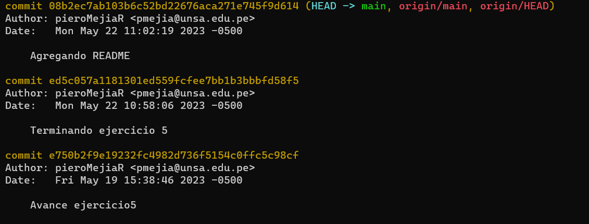
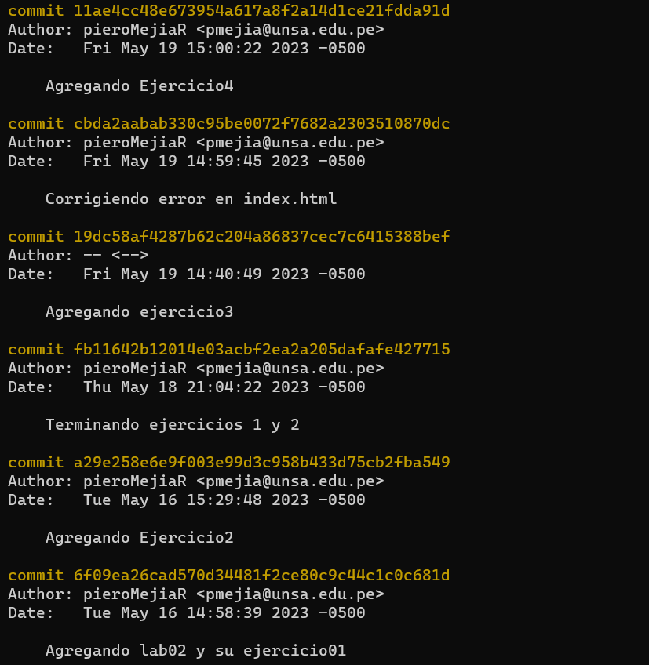

<table>
    <theader>
        <tr>
            <td></td>
            <th>
                UNIVERSIDAD NACIONAL DE SAN AGUSTIN 
                FACULTAD DE INGENIERÍA DE PRODUCCIÓN Y SERVICIOS 
                DEPARTAMENTO ACADÉMICO DE INGENIERÍA DE SISTEMAS E INFORMÁTICA 
                ESCUELA PROFESIONAL DE INGENIERÍA DE SISTEMAS
            </th>
            <td></td>
        </tr>
    </theader>
    <tbody>
        <tr><td colspan="3">Formato: Guía de Práctica de Laboratorio</td></tr>
        <tr><td>Aprobación:  2022/03/01</td><td>Código: GUIA-PRLD-001</td><td>Página: 1</td></tr>
    </tbody>
</table>

GUÍA DE LABORATORIO 

<table>
<theader>
<tr><th colspan="6">INFORMACIÓN BÁSICA</th></tr>
</theader>
<tbody>
<tr><td>ASIGNATURA:</td><td colspan="5">Programación Web 2</td></tr>
<tr><td>TÍTULO DE LA PRÁCTICA:</td><td colspan="5">JavaScript</td></tr>
<tr>
<td>NÚMERO DE PRÁCTICA:</td><td>02</td><td>AÑO LECTIVO:</td><td>2022 A</td><td>NRO. SEMESTRE:</td><td>III</td>
</tr>
<tr>
<td>FECHA INICIO::</td><td>02-May-2022</td><td>FECHA FIN:</td><td>06-May-2022</td><td>DURACIÓN:</td><td>04 horas</td>
</tr>
<tr><td colspan="6">RECURSOS:
    <ul>
        <li><a href="https://www.w3schools.com/js">https://www.w3schools.com/js</a></li>        
    </ul>
</td>
</<tr>
<tr><td colspan="6">Estudiante:
<ul>
<li>Mejia Ramos Piero Douglas - pmejia@unsa.edu.pe</li>
</ul>
</td>
</<tr>
<tr><td colspan="6">Docente:
<ul>
<li>Anibal Sardon</li>
</ul>
</td>
</<tr>
</tdbody>
</table>

# JavaScript

[![License][license]][license-file]
[![Downloads][downloads]][releases]
[![Last Commit][last-commit]][releases]

[![Debian][Debian]][debian-site]
[![Git][Git]][git-site]
[![GitHub][GitHub]][github-site]
[![Vim][Vim]][vim-site]
[![Java][Java]][java-site]

#

## OBJETIVOS TEMAS Y COMPETENCIAS

### OBJETIVOS

- Desarrollar habilidades básicas de programación usando JavaScript

### TEMAS
- JavaScript sintaxis básica, programación funcional.

COMPETENCIAS

- C.c Diseña responsablemente sistemas, componentes o procesos para satisfacer necesidades dentro de restricciones realistas: económicas, medio ambientales, sociales, políticas, éticas, de salud, de seguridad, manufacturación y sostenibilidad.
- C.m Construye responsablemente soluciones siguiendo un proceso adecuado llevando a cabo las pruebas ajustada a los recursos disponibles del cliente.
- C.p Aplica de forma flexible técnicas, métodos, principios, normas, estándares y herramientas de ingeniería necesarias para la construcción de software e implementación de sistemas de información.

### MARCO CONCEPTUAL

- https://www.w3schools.com/js

## EJERCICIOS PROPUESTOS

COMMITS:

- Repositorio - https://github.com/pieroMejiaR/PWeb2-lab/tree/main/lab02

- FlipGrid - https://flip.com/s/FzpfSbV9YWQK

## CUESTIONARIO
- Pruebe este código de arrayGenerator() en la página https://jslint.com/
- Revisar esta discusión en stackoverflow - https://stackoverflow.com/questions/4852017/how-to-initialize-an-arrays-length-in-javascript
    - ¿Cómo se pueden resolver los warnings?

        Se debe revisar cuidadosamente el código, prestando atención a la declaración de tipos, el tamaño del array, los índices y las conversiones de tipos. Luego de entender y abordar las advertencias , produciremos un código más limpio y evitaremos posibles problemas en el futuro.

    - ¿Se puede modificar la solución usando map? ¿Cómo?

        Sí, se puede usar el metodo map. Es bastante util. Esta se puede usar para una matriz de numeros enteros.

        var a = [...Array(3)].map(x => []);

#

## REFERENCIAS
- Javascript tutorial. https://www.w3schools.com/javascript/default.asp, 2021. Accesed: 02-09-2021.
- Loiane Groner. Learning JavaScript Data Structures and Algorithms: Write complex and powerful
- Validador HTML - https://validator.w3.org/
- Validador CSS - https://jigsaw.w3.org/css-validator/

#

[license]: https://img.shields.io/github/license/rescobedoq/pw2?label=rescobedoq
[license-file]: https://github.com/rescobedoq/pw2/blob/main/LICENSE

[downloads]: https://img.shields.io/github/downloads/rescobedoq/pw2/total?label=Downloads
[releases]: https://github.com/rescobedoq/pw2/releases/

[last-commit]: https://img.shields.io/github/last-commit/rescobedoq/pw2?label=Last%20Commit

[Debian]: https://img.shields.io/badge/Debian-D70A53?style=for-the-badge&logo=debian&logoColor=white
[debian-site]: https://www.debian.org/index.es.html

[Git]: https://img.shields.io/badge/git-%23F05033.svg?style=for-the-badge&logo=git&logoColor=white
[git-site]: https://git-scm.com/

[GitHub]: https://img.shields.io/badge/github-%23121011.svg?style=for-the-badge&logo=github&logoColor=white
[github-site]: https://github.com/

[Vim]: https://img.shields.io/badge/VIM-%2311AB00.svg?style=for-the-badge&logo=vim&logoColor=white
[vim-site]: https://www.vim.org/

[Java]: https://img.shields.io/badge/java-%23ED8B00.svg?style=for-the-badge&logo=java&logoColor=white
[java-site]: https://docs.oracle.com/javase/tutorial/

[![Debian][Debian]][debian-site]
[![Git][Git]][git-site]
[![GitHub][GitHub]][github-site]
[![Vim][Vim]][vim-site]
[![Java][Java]][java-site]

[![License][license]][license-file]
[![Downloads][downloads]][releases]
[![Last Commit][last-commit]][releases]
