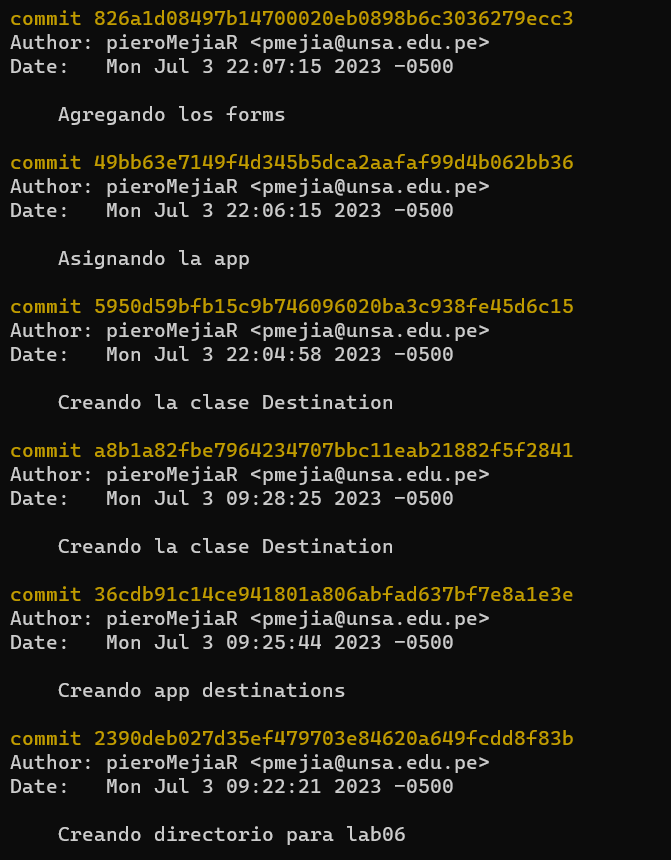
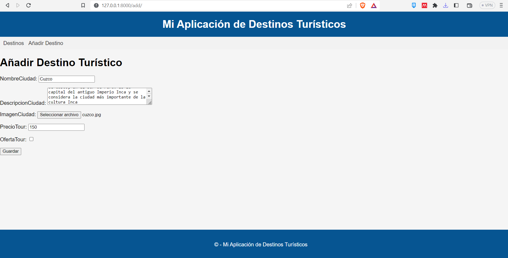
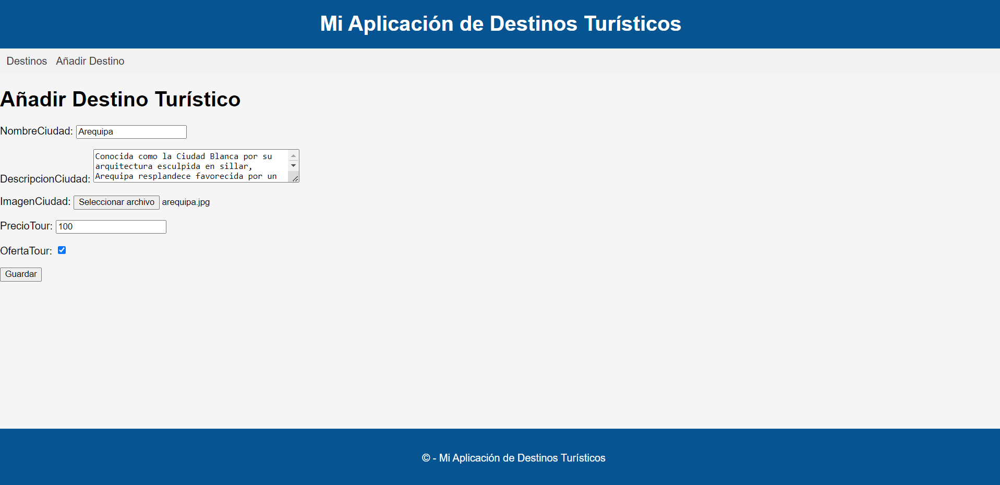
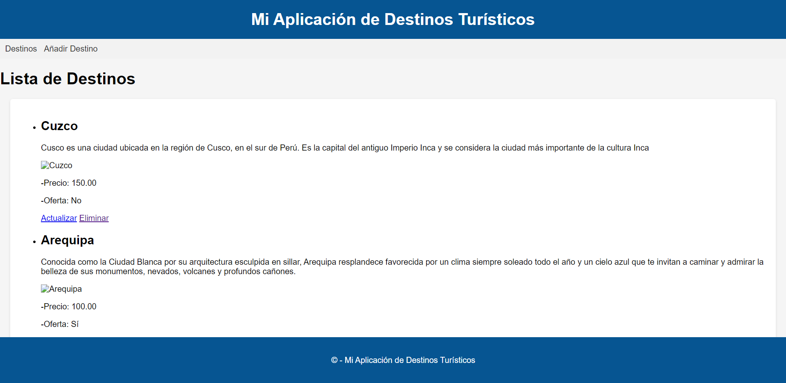
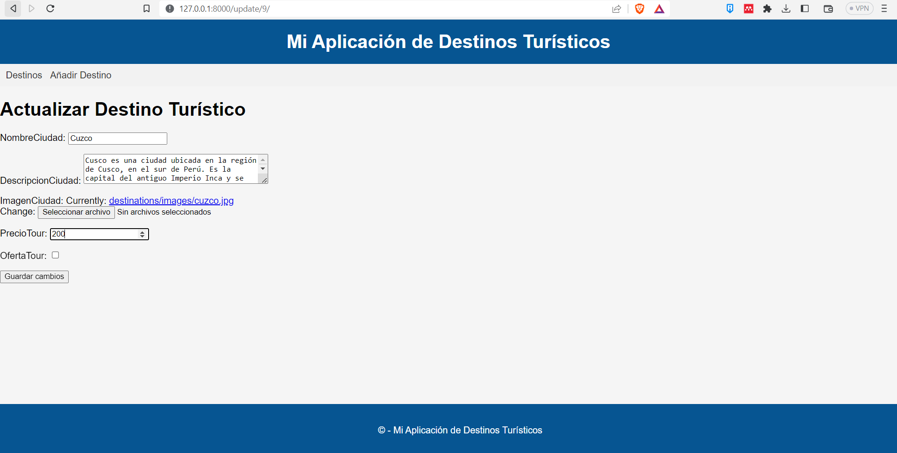
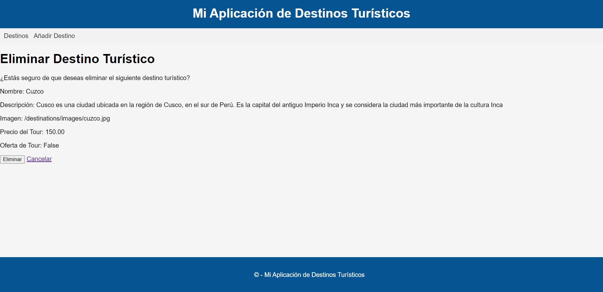
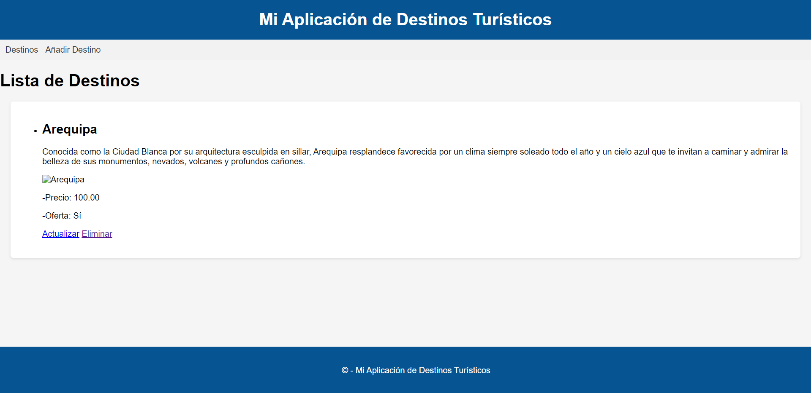

<table>
    <theader>
        <tr>
            <td></td>
            <th>
                UNIVERSIDAD NACIONAL DE SAN AGUSTIN 
                FACULTAD DE INGENIERÍA DE PRODUCCIÓN Y SERVICIOS 
                DEPARTAMENTO ACADÉMICO DE INGENIERÍA DE SISTEMAS E INFORMÁTICA 
                ESCUELA PROFESIONAL DE INGENIERÍA DE SISTEMAS
            </th>
            <td></td>
        </tr>
    </theader>
    <tbody>
        <tr><td colspan="3">Formato: Guía de Práctica de Laboratorio</td></tr>
        <tr><td>Aprobación:  2022/03/01</td><td>Código: GUIA-PRLD-001</td><td>Página: 1</td></tr>
    </tbody>
</table>

GUÍA DE LABORATORIO 

<table>
<theader>
<tr><th colspan="6">INFORMACIÓN BÁSICA</th></tr>
</theader>
<tbody>
<tr><td>ASIGNATURA:</td><td colspan="5">Programación Web 2</td></tr>
<tr><td>TÍTULO DE LA PRÁCTICA:</td><td colspan="5">Django</td></tr>
<tr>
<td>NÚMERO DE PRÁCTICA:</td><td>06</td><td>AÑO LECTIVO:</td><td>2023</td><td>NRO. SEMESTRE:</td><td>III</td>
</tr>
<tr>
<td>FECHA INICIO::</td><td>20-June-2023</td><td>FECHA FIN:</td><td>31-June-2023</td><td>DURACIÓN:</td><td>04 horas</td>
</tr>
<tr><td colspan="6">RECURSOS:
    <ul>
        <li>https://www.w3schools.com/python/python_reference.asp</li>
        <li>https://docs.python.org/3/tutorial/</li>
        <li>https://developer.mozilla.org/es/docs/Learn/Server-side/Django/Models</li>
        <li>https://tutorial.djangogirls.org/es/django_models/</li>
        <li>https://pear.php.net/manual/en/standards.php</li>
        <li>https://docs.djangoproject.com/en/4.0/</li>
        <li>https://www.youtube.com/watch?v=M4NIs4BM1dk</li>
        <li>https://pypi.org/</li>
        <li>https://pip.pypa.io/en/latest/user_guide/</li>
        <li>https://packaging.python.org/en/latest/tutorials/installing-packages/</li>
    </ul>
</td>
</<tr>
<tr><td colspan="6">DOCENTES:
<ul>
<li>Anibal Sardon</li>
</ul>
</td>
</<tr>
<tr><td colspan="6">Estudiante:
<ul>
<li>Piero Douglas Mejia Ramos - pmejia@unsa.edu.pe</li>
</ul>
</td>
</<tr>
</tdbody>
</table>

# Django

[![License][license]][license-file]
[![Downloads][downloads]][releases]
[![Last Commit][last-commit]][releases]

[![Debian][Debian]][debian-site]
[![Git][Git]][git-site]
[![GitHub][GitHub]][github-site]
[![Vim][Vim]][vim-site]
[![Java][Java]][java-site]

#

## OBJETIVOS TEMAS Y COMPETENCIAS

### OBJETIVOS

-   Crear un Proyecto Django dentro de un entorno virtual.

### TEMAS
-   Entorno virtual
-   Django
-   Modelos
-   Migraciones
-   Panel de administración

COMPETENCIAS

- C.c Diseña responsablemente sistemas, componentes o procesos para satisfacer necesidades dentro de restricciones realistas: económicas, medio ambientales, sociales, políticas, éticas, de salud, de seguridad, manufacturación y sostenibilidad.
- C.m Construye responsablemente soluciones siguiendo un proceso adecuado llevando a cabo las pruebas ajustada a los recursos disponibles del cliente.
- C.p Aplica de forma flexible técnicas, métodos, principios, normas, estándares y herramientas de ingeniería necesarias para la construcción de software e implementación de sistemas de información.

## CONTENIDO DE LA GUÍA
-  Implementar una aplicación en Django utilizando una plantilla profesional.
-  Utilizar una tabla de Destinos turísticos para leer y completar la página web.
-  Utilizar los tags “if” y “for” en los archivos html para leer todos los registros de
una tabla desde una base de datos.
### MARCO CONCEPTUAL

-  Un framework es una abstracción en la cual se puede reusar código y funcionalidades
adaptándolos a nuestras necesidades.
-  Un modelo en un framework se suele referir a los datos y su organización
-  Una vista permite apreciar el resultado de la lectura de una tabla incluida en una página
web.

## EJERCICIOS PROPUESTOS
-   Deberán replicar la actividad del video donde se obtiene una plantilla de
una aplicación de Destinos turísticos y adecuarla a un proyecto en blanco
Django.
-   Luego trabajar con un modelo de tabla DestinosTuristicos donde se
guarden nombreCiudad, descripcionCiudad, imagenCiudad, precioTour,
ofertaTour (booleano). Estos destinos turísticos deberán ser agregados
en una vista dinámica utilizando tags for e if.
-   Para ello crear una carpeta dentro del proyecto github colaborativo con el
docente, e informar el link donde se encuentra.
-   Crear formularios de Añadir Destinos Turísticos, Modificar, Listar y
Eliminar Destinos.
-   Ya sabes que el trabajo con Git es obligatorio. Revisa el avance de la
teoría Django parte4

## Commits

## Evidencia de los ejercicios resueltos

-Agregando destinos

-Mostrandolos en la lista

-Actualizando destino

-Eliminando destino

-Mostrandolos la lista despues de eliminar

## REFERENCIAS
-   https://www.w3schools.com/python/python_reference.asp
-   https://docs.python.org/3/tutorial/
-   https://developer.mozilla.org/es/docs/Learn/Server-side/Django/Models
-   https://tutorial.djangogirls.org/es/django_models/
-   https://pear.php.net/manual/en/standards.php
-   https://docs.djangoproject.com/en/4.0/
-   https://www.youtube.com/watch?v=M4NIs4BM1dk
-   https://pypi.org/
-   https://pip.pypa.io/en/latest/user_guide/
-   https://packaging.python.org/en/latest/tutorials/installing-packages/

#

[license]: https://img.shields.io/github/license/rescobedoq/pw2?label=rescobedoq
[license-file]: https://github.com/rescobedoq/pw2/blob/main/LICENSE

[downloads]: https://img.shields.io/github/downloads/rescobedoq/pw2/total?label=Downloads
[releases]: https://github.com/rescobedoq/pw2/releases/

[last-commit]: https://img.shields.io/github/last-commit/rescobedoq/pw2?label=Last%20Commit

[Debian]: https://img.shields.io/badge/Debian-D70A53?style=for-the-badge&logo=debian&logoColor=white
[debian-site]: https://www.debian.org/index.es.html

[Git]: https://img.shields.io/badge/git-%23F05033.svg?style=for-the-badge&logo=git&logoColor=white
[git-site]: https://git-scm.com/

[GitHub]: https://img.shields.io/badge/github-%23121011.svg?style=for-the-badge&logo=github&logoColor=white
[github-site]: https://github.com/

[Vim]: https://img.shields.io/badge/VIM-%2311AB00.svg?style=for-the-badge&logo=vim&logoColor=white
[vim-site]: https://www.vim.org/

[Java]: https://img.shields.io/badge/java-%23ED8B00.svg?style=for-the-badge&logo=java&logoColor=white
[java-site]: https://docs.oracle.com/javase/tutorial/

[![Debian][Debian]][debian-site]
[![Git][Git]][git-site]
[![GitHub][GitHub]][github-site]
[![Vim][Vim]][vim-site]
[![Java][Java]][java-site]

[![License][license]][license-file]
[![Downloads][downloads]][releases]
[![Last Commit][last-commit]][releases]
